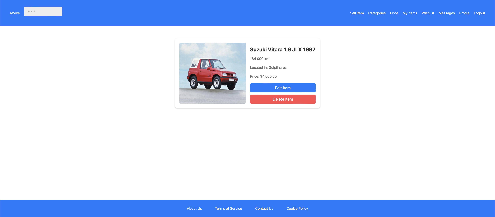

# ReVive

## Group ltw01g02

- Gonçalo Matias (up202108703) 40%
- Pedro Plácido (up202107987) 30%
- Gonçalo Barroso (up202207832) 30%

## Install Instructions

    git clone https://github.com/FEUP-LTW-2024/ltw-project-2024-ltw01g02
    git checkout final-delivery-v1
    sqlite3 database/database.db < database/script.sql
    php -S localhost:9000

## Screenshots

## Implemented Features

**General**:

- [x] Register a new account.
- [x] Log in and out.
- [x] Edit their profile, including their name, username, password, and email.

**Sellers** should be able to:

- [x] List new items, providing details such as category, brand, model, size, and condition, along with images.
- [x] Track and manage their listed items.
- [x] Respond to inquiries from buyers regarding their items and add further information if needed.
- [x] Print shipping forms for items that have been sold.

**Buyers** should be able to:

- [x] Browse items using filters like category, price, and condition.
- [x] Engage with sellers to ask questions or negotiate prices.
- [x] Add items to a wishlist or shopping cart.
- [x] Proceed to checkout with their shopping cart (simulate payment process).

**Admins** should be able to:

- [x] Elevate a user to admin status.
- [x] Introduce new item categories, sizes, conditions, and other pertinent entities.
- [x] Oversee and ensure the smooth operation of the entire system.

**Security**:
We have been careful with the following security aspects:

- [x] **SQL injection**
- [x] **Cross-Site Scripting (XSS)**
- [x] **Cross-Site Request Forgery (CSRF)**

**Password Storage Mechanism**: `password_hash` and `password_verify`

**Aditional Requirements**:

We also implemented the following additional requirements:

- [x] **Rating and Review System**
- [ ] **Promotional Features**
- [ ] **Analytics Dashboard**
- [x] **Multi-Currency Support**
- [ ] **Item Swapping**
- [ ] **API Integration**
- [ ] **Dynamic Promotions**
- [ ] **User Preferences**
- [ ] **Shipping Costs**
- [x] **Real-Time Messaging System**
- [x] **UI for smaller screens**